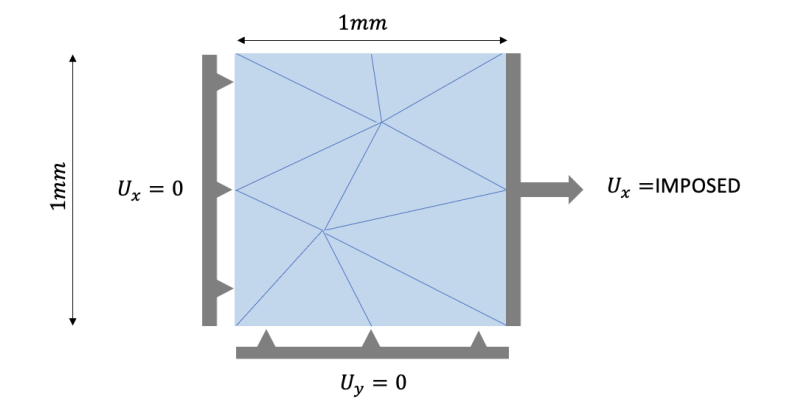

# Traction test

This test consists in pulling on a the right side (*i.e.* on the "RIGHT"
boundary, as denoted in the figure) of a square, that is attached on the
left side (named "LEFT" in the figure). The bottom ("BOTTOM" in the figure)
is fixed for transversal displacements.



## Imports

Import library and relevant classes

``` code
from numpy import ndarray
from pythhon.pbbb.problem import Problem
from pythhon.pbbb.boundary_condition import BoundaryCondition
from pythhon.pbbb.load import Load
from pythhon.pbbb.field import Field
from pythhon.fem.element.finite_element import FiniteElement
from pythhon.parameters import *
from pp.post_processing import *
from mgis import behaviour as mgis_bv
from pythhon.pbbb.material import Material
```

## Loading and time steps

Define pseudo-time steps.

``` code
time_steps = np.linspace(0.0, 0.008, 3, dtype=real)
iterations = 12
```

## Boundary conditions

Define boundary conditions. The pull function defines the displacement
loading to apply to "RIGHT" : the displacement loading is equal to the
time step increment, such that pseudo-time steps are interpretable as
displacement loadings.

The fixed function describes the clamping of the face "LEFT" of the square.


``` code
def pull(time: float, position: ndarray) -> float:
    return time

def fixed(time: float, position: ndarray) -> float:
    return 0.0

boundary_conditions = [
    BoundaryCondition("RIGHT", pull, BoundaryType.DISPLACEMENT, 0),
    BoundaryCondition("LEFT", fixed, BoundaryType.DISPLACEMENT, 0),
    BoundaryCondition("BOTTOM", fixed, BoundaryType.DISPLACEMENT, 1),
]

```

## Volumetric load

Define the volumetric load (*i.e.* the weight in the material) : it is
neglected here, and is set to 0.

``` code
def volumetric_load(time: float, position: ndarray):
    return 0

loads = [Load(volumetric_load, 0), Load(volumetric_load, 1)]

```

## Load mesh file

load the geof mesh file

``` code
mesh_file_path = "../meshes/square_1.geof"

```

## Deifne field

Define the dield under study (*i.e.* whether it is a displacement,
a scalar field, which stress and strain measures are chosen, etc.)

In this exemple, the field is a displacement in 2 dimensions, assunming
a plain strain hypothesis, in a small strains framework.

``` code
displacement = Field(
    label="U",
    euclidean_dimension=2,
    field_type=FieldType.DISPLACEMENT_PLANE_STRAIN,
    strain_type=StrainType.DISPLACEMENT_SYMMETRIC_GRADIENT,
    stress_type=StressType.CAUCHY,
    derivation_type=DerivationType.SYMMETRIC,
)

```

## Define finite element

Define the finite element type to use, *i.e.* the polynomial discretization

``` code
finite_element = FiniteElement(
    element_type=ElementType.HDG_EQUAL,
    polynomial_order=1,
    euclidean_dimension=2,
    basis_type=BasisType.MONOMIAL
)

```

## Build the problem to solve

Depending on the chosen finite element, field, mesh, loads and boundary
conditions, we now bhuild the global problem to solve

``` code
p = Problem(
    mesh_file_path=mesh_file_path,
    field=displacement,
    polynomial_order=finite_element.polynomial_order,
    finite_element=finite_element,
    time_steps=time_steps,
    iterations=iterations,
    boundary_conditions=boundary_conditions,
    loads=loads,
    quadrature_type=QuadratureType.GAUSS,
    tolerance=1.e-5
)

```

## Define material

Define the material parameters, hypothesis, etc. that are passed
as argument to build the mgis material data manager

``` code
parameters = {"YoungModulus": 1.0, "PoissonRatio": 0.0}
stabilization_parameter = parameters["YoungModulus"] / (1.0 + parameters["PoissonRatio"])

mat = Material(
    nq=p.mesh.number_of_cell_quadrature_points_in_mesh,
    library_path="../behaviour/src/libBehaviour.so",
    library_name="Elasticity",
    hypothesis=mgis_bv.Hypothesis.PLANESTRAIN,
    stabilization_parameter=stabilization_parameter,
    lagrange_parameter=parameters["YoungModulus"],
    field=displacement,
    parameters=None,
)

```

## Launch computations

Actually launch the computation

``` code
p.solve_newton_2(mat, verbose=False, check=False)

```

## Post processing

Post process the solution, and plot the stress strain curve

``` code
from tests.test_mecha.test_square_elasticity.pp import plot_data_2 
mtest_file_path = (
    "../mtest/traction_x_elasticity.res"
)
hho_file_path = "../../../../res"
plot_data_2(mtest_file_path, hho_file_path, len(time_steps), 1, 5, 4, 8)
plot_data_2(mtest_file_path, hho_file_path, len(time_steps), 1, 6, 4, 9)
plot_data_2(mtest_file_path, hho_file_path, len(time_steps), 1, 7, 4, 10)
plot_data_2(mtest_file_path, hho_file_path, len(time_steps), 1, 8, 4, 11)

```